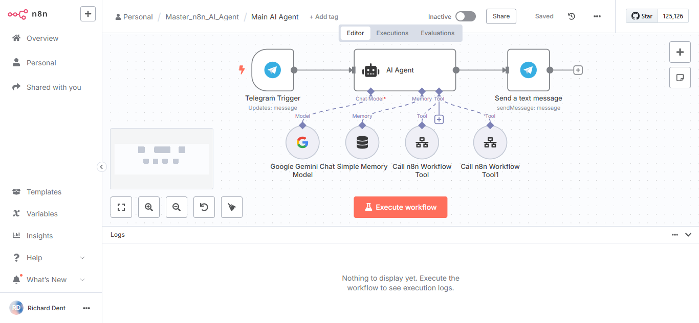

# Simple Personal Assistant

The Simple Personal Assistant AI Agent can schedule important events for you and keep everyone update about those important events.

## AI Automation Specifications

- Main AI Agent: Using Telegram to schedule important events and to keep those that need to know about those important events informed as well.
- Calendar Sub Agent: Calendar Sub Agent creates, updates, and deletes important events in your Google Calendar.
- Email Sub Agent: Using your Google Contacts to email everyone about the important events you have scheduled.
- Google Calendar: Google Calendar keeps track of those important scheduled events.
